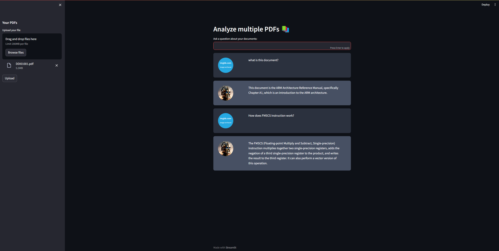

# pdf-chatbot

Chatbot for PDF Analysis simplifies the task of extracting information from PDF files. Its user-friendly interface allows users to interact conversationally, making processes like text extraction, question-answering, and keyword searches more accessible and efficient.
This project was made based on this YT Tutorial: [Chat with Multiple PDFs | LangChain App Tutorial in Python (Free LLMs and Embeddings)](https://www.youtube.com/watch?v=dXxQ0LR-3Hg&t=3516s&ab_channel=AlejandroAO-Software%26Ai)



To run the project locally first download dependecies:

```python 
pip install -r requirements.txt
```
NOTE: For PyTorch packages, you should visit [official PyTorch website](https://pytorch.org/get-started/locally/) and download version fitting to your OS.

Secondly, add .env file with HuggingFace token:
```python 
HUGGINGFACEHUB_API_TOKEN = your_token
```
Finally, run the project with:
```python 
streamlit run app.py
```
# Used Technologies and Libraries
- LangChain
- Streamlit
- FAISS as Vector Database
- flan-t5-xxl as LLM
- instructor-xxl for Embeddings